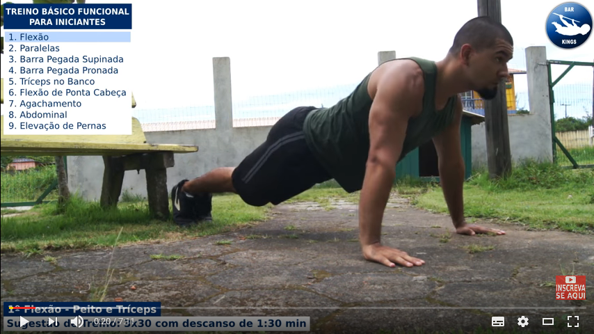

<!-- page_number: true -->
# Melhore seu código sem suar a camisa com Object Calisthenics

## Eduardo Nascimento
### Desenvolvedor @ Pagar.me

---
## Calisthenics?
- καλλος (kallos = beleza), σθενος (sthenos = força)


---
## Calisthenics?

- [Youtube](https://www.youtube.com/watch?v=yQ7gpvDQLbE)

---
## Serious Talk
- [ThoughtWorks Anthology - Jeff Bay (2008)](https://pragprog.com/book/twa/thoughtworks-anthology)

---
### Goal
- Maintainable
- Readable/Comprehensible
- Testable
- Reusable

---
## One level of indentation per method
```php
public function getUserTotalTax(User $user)
{
    $taxTotal = 0;

    $orders = $orderService->getOrdersFromUser($user);

    foreach ($orders as $order) {
        $products = $order->getProducts();

        foreach ($products as $product) {
            if ($product->isImported()) {
                $taxTotal += $product->getTax();
            }
        }
    }

    return $taxTotal;
}

```
---
## One level of indentation per method
```php
public function getUserTotalTax(User $user)
{
    $orders = $orderService->getOrdersFromUser($user);
	
    return $this->getOrdersTotalTax($orders)
    
}
```
---
## One level of indentation per method
```php
public function getOrdersTotalTax($orders)
{
    $ordersTotalTax = 0;

    foreach ($orders as $order) {
        $ordersTotalTax += $this->getOrderTotalTax($order);
    }
    
    return $ordersTotalTax;
}
```

---
## One level of indentation per method
```php
public function getOrderTotalTax(Order $order)
{
    $orderTotalTax = 0;

    $products = $order->getProducts();

    foreach ($products as $product) {
        $orderTotalTax += $this->getProductTotalTax(
        	$product
        );
    }
    
    return $orderTotalTax;
}
```
---
## One level of indentation per method
```php
public function getProductTotalTax(Product $product)
{
    if ($product->isImported()) {
        return $product->getTax();
    }

    return 0;
}
```
---
## One level of indentation per method
- Extract Method (Martin Fowler)

---
## Don't use the ELSE keyword
```php
public function getPaymentMethod(Payment $payment)
{
    $paymentMethod = 'Drébito';
    
    if ($payment->getType() == Payment::CreditCard) {
        $paymentMethod = 'Cartão de Crédito';
    } else if ($payment->getType() == Payment::DebitCard) {
        $paymentMethod = 'Cartão de Débito';
    } else {
        throw new \Exception($paymentMethod);
    }

    return $paymentMethod;
}
```
---
## Don't use the ELSE keyword
```php
public function getPaymentMethod(Payment $payment)
{
    if ($payment->getType() == Payment::CreditCard) {
        return 'Cartão de Crédito';
    }

    if ($payment->getType() == Payment::DebitCard) {
        return 'Cartão de Débito';
    }

    throw new \Exception("Drébito?");
}
```
---
## Don't use the ELSE keyword
- Early return
- Default success x Defensive programming

---
## Wrap all primitives and Strings in classes
```php
public function scheduleTalk(Talk talk,$time);

$event->scheduleTalk($myTalk, '2017-07-22 13:37');
$event->scheduleTalk($myTalk, '07-02-2017 1:37 PM');
$event->scheduleTalk($myTalk, '07-02-2017');
$event->scheduleTalk($myTalk, '1499799394');

``` 
---
## Wrap all primitives and Strings in classes
```php

public function scheduleTalk(
	Talk $myTalk,
    \DateTime $dateTime
);

$event->scheduleTalk($myTalk, $dateTime)
```

---
## Wrap all primitives and Strings in classes
- TypeHinting

---
## First class collections
```php
public function getOrdersTotalTax($orders)
{
    $ordersTotalTax = 0;

    foreach ($orders as $order) {
        $ordersTotalTax += $this->getOrderTotalTax($order);
    }
    
    return $ordersTotalTax;
}
```
---
## First class collections
```php
public function getOrdersTotalTax(
	OrderCollection $orders
) {
    $ordersTotalTax = 0;

    foreach ($orders as $order) {
        $ordersTotalTax += $this->getOrderTotalTax(
        	$order
        );
    }
    
    return $ordersTotalTax;
}
```
---
## First class collections
- Avoid array dependency
- SPL Interfaces ( Traversable, IteratorIterator, ArrayIterator)

---
## One ~~dot~~ "->" per line
```php
$streetName = $order->getCustomer()
    ->getAddress()
    ->getStreetName();
```
---
## One ~~dot~~ "->" per line
```php
$customer = $order->getCustomer();
$address = $customer->getAddress()
$streetName = $address->getStreetName();
```
---
## One ~~dot~~ "->" per line
- Law Of Demeter/Don't talk to strangers
- Chained getters hard to test, chained properties are evil
- Fluent Interfaces are ok

---
## Don't abbreviate
```php
lstUsr()
listUsers()


$mVIV
$myVeryImportantVariable
```
---
## Keep All Entities Small
- Classes < 50 linhas
- Package < 10 files

---
## No classes with more than two instance variables
- @rdohms says 5
- high cohesion, and better encapsulation.
- reduce dependency
---
## No getters or setters
```php
$panel->setNotifications($state)

$panel->enableNotifications()
$panel->disableNotifications()
```
---
## No getters or setters
```php
$transaction->getState()

$transaction->isPaid()
$transaction->isPending()
```
---
## No getters or setters
- Tell, don't ask
---
## Referencias
http://williamdurand.fr/2013/06/03/object-calisthenics/
https://fr.slideshare.net/rdohms/bettercode-phpbenelux212alternate/

---
# Thank you all!
eduardo@eduardonascimento.com.br
http://github/xduh
https://www.linkedin.com/in/duhnascimento

## Work with us: code@pagar.me